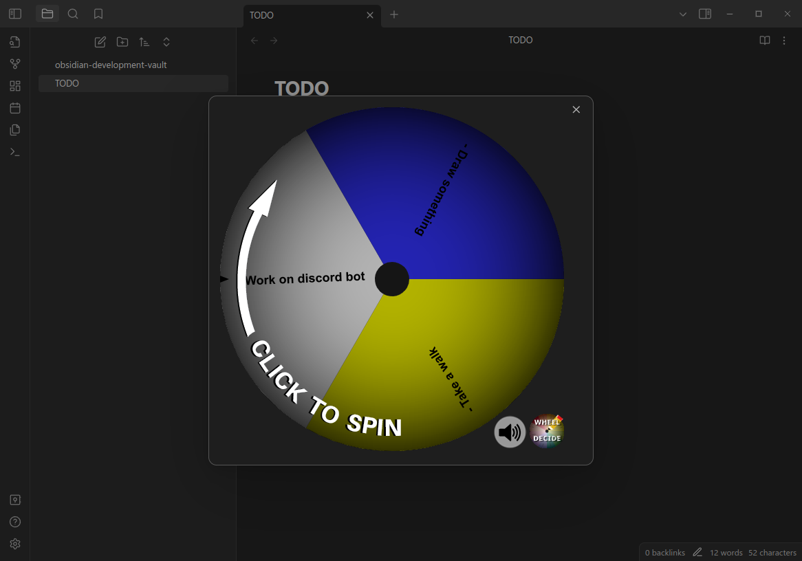

# obsidian-wheel-decide
When you need a wheel to make decisions for you. Select some lines, press `ctrl+p` and run "Wheel Decide: Create decision wheel". This will open a modal for you with a decision wheel.



## Setup
```bash
cd /to/your/vault
mkdir -p .obsidian/plugins
cd .obsidian/plugins

git clone https://git.cesium.pw/niku/obsidian-wheel-decide.git
cd obsidian-wheel-decide

npm install
npm run build
```

Then you can enable it like any other community plugin.
